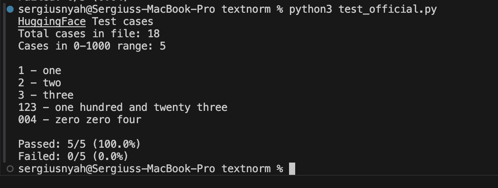

# Text Normalization - Cardinal Numbers

Converts numbers from 0-1000 to words using FST approach.

## What it does

It takes numbers in text and writes them out in plain language:
E.g:
- "I have 3 dogs" becomes "I have three dogs"
- "Room 42" becomes "Room forty two"
- "123" becomes "one hundred and twenty three"

## How to use

Basic usage:
```bash
python3 src/normalize.py "I have 3 dogs and 21 cats"
```

For files:
```bash
python3 src/normalize.py --file input.txt --output output.txt
```

Using the compiled grammar:
```python
import pickle

with open('grammars/cardinal_grammar.far', 'rb') as f:
    data = pickle.load(f)
    grammar = data['grammar']

result = grammar.normalize_number("42")
print(result)  # forty two
```

## Testing

Test against official HuggingFace dataset:
```bash
python3 tests/test_official.py
```

### Test Results



Tested against the [official HuggingFace test cases](https://huggingface.co/datasets/DigitalUmuganda/Text_Normalization_Challenge_Unittests_Eng_Fra). All 5 test cases in the 0-1000 range pass with 100% accuracy.

## Implementation details

Uses a pure Python FST-inspired approach with:
- Lookup tables for digits (0-9), teens (10-19), and tens (20, 30, 40 etc)
- Compositional rules to combine them (e.g., 42 = "forty" + " " + "two")
- British English format: "and" in hundreds (e.g., "one hundred and twenty three")
- Special handling for leading zeros (read digit-by-digit)
- 1000 is hardcoded as "one thousand"

No external dependencies required.

## Requirements
Python 3.7+ 

